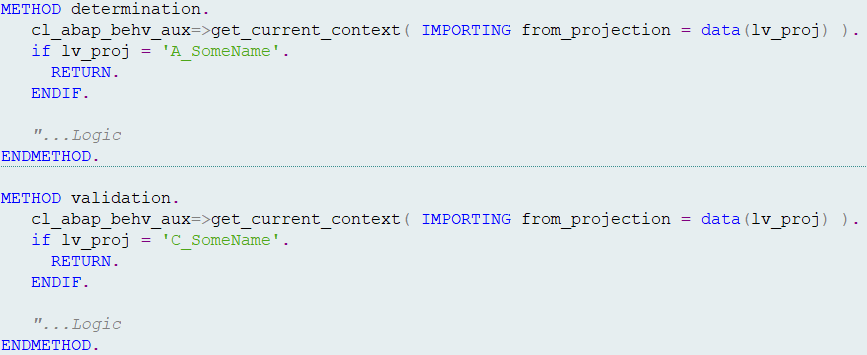

# The usage of the class 𝗰𝗹_𝗮𝗯𝗮𝗽_𝗯𝗲𝗵𝘃_𝗮𝘂𝘅.

Recently, I came across a scenario I’d like to share. I had a BDEF named `R_SomeName`, and on top of that, I created two projections: one for the `UI (C_SomeName)` and another for the `API (A_SomeName)`.

Now, here's the interesting part: `R_SomeName` contains some validations and determinations. For the time being, I only want these to execute when the call is coming from the UI, not from the API.

So, how can we distinguish whether the call originates from the UI or the API? This is where the class `𝗰𝗹_𝗮𝗯𝗮𝗽_𝗯𝗲𝗵𝘃_𝗮𝘂𝘅` comes in handy:

`𝗰𝗹_𝗮𝗯𝗮𝗽_𝗯𝗲𝗵𝘃_𝗮𝘂𝘅=>𝗴𝗲𝘁_𝗰𝘂𝗿𝗿𝗲𝗻𝘁_𝗰𝗼𝗻𝘁𝗲𝘅𝘁( 𝗜𝗠𝗣𝗢𝗥𝗧𝗜𝗡𝗚 𝗳𝗿𝗼𝗺_𝗽𝗿𝗼𝗷𝗲𝗰𝘁𝗶𝗼𝗻 = 𝗗𝗔𝗧𝗔(𝗹𝘃_𝗽𝗿𝗼𝗷) ).`

The lv_proj variable will hold the name of the calling projection `C_SomeName` if the call is from the UI or `A_SomeName` if it’s from the API. Based on this, you can conditionally execute logic in the handler class of `R_SomeName`.

