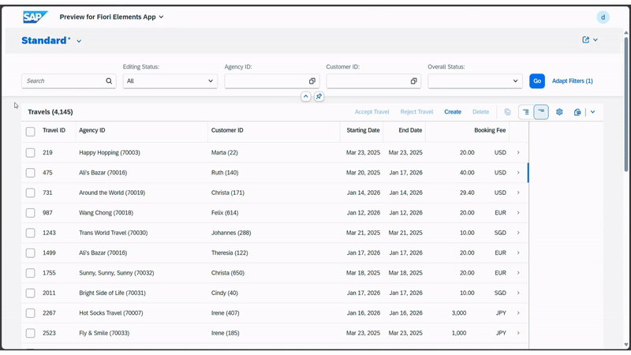

# 𝗘𝗻𝗮𝗯𝗹𝗲 𝗦𝗲𝗮𝗿𝗰𝗵 𝗼𝗻 𝗖𝗵𝗶𝗹𝗱 𝗘𝗻𝘁𝗶𝘁𝘆 𝗙𝗶𝗲𝗹𝗱𝘀 𝗶𝗻 𝗟𝗶𝘀𝘁 𝗥𝗲𝗽𝗼𝗿𝘁

If you want to make fields from an child entity available in the global search(List Report), Just follow these steps to achieve.

In your Root Entity, mark the exposed child entity with the annotation:
`@𝗦𝗲𝗮𝗿𝗰𝗵.𝗱𝗲𝗳𝗮𝘂𝗹𝘁𝗦𝗲𝗮𝗿𝗰𝗵𝗘𝗹𝗲𝗺𝗲𝗻𝘁: 𝘁𝗿𝘂𝗲`
`_𝗕𝗼𝗼𝗸𝗶𝗻𝗴;`

In the child entity, specify the fields you want to be searchable:
`@𝗦𝗲𝗮𝗿𝗰𝗵.𝗱𝗲𝗳𝗮𝘂𝗹𝘁𝗦𝗲𝗮𝗿𝗰𝗵𝗘𝗹𝗲𝗺𝗲𝗻𝘁: 𝘁𝗿𝘂𝗲`
`𝗖𝗮𝗿𝗿𝗶𝗲𝗿𝗡𝗮𝗺𝗲;`

You can also enhance the search experience by enabling fuzzy search settings. Once this is done, the relevant fields will be included in the global search.

