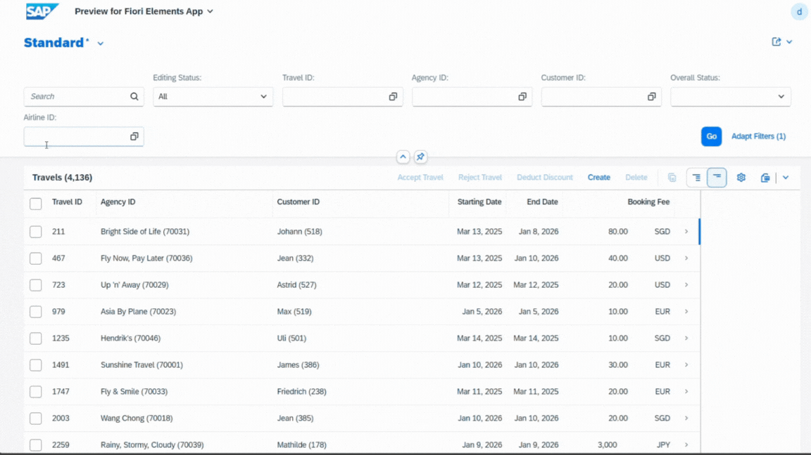

# Filter List Reports by Child Entity Fields

Have you ever wanted to filter a list report based on a field from a child entity? For example, filtering travel records by the AirlineID from the associated _Booking entity?

You can achieve this by adding the following annotation to the root CDS view metadata extensions (e.g., Travel):\

`@𝗨𝗜.𝘀𝗲𝗹𝗲𝗰𝘁𝗶𝗼𝗻𝗙𝗶𝗲𝗹𝗱: [{ 𝗲𝗹𝗲𝗺𝗲𝗻𝘁: '_𝗕𝗼𝗼𝗸𝗶𝗻𝗴.𝗔𝗶𝗿𝗹𝗶𝗻𝗲𝗜𝗗', 𝗽𝗼𝘀𝗶𝘁𝗶𝗼𝗻: 𝟱𝟬 }]`\
`_𝗕𝗼𝗼𝗸𝗶𝗻𝗴;`

I tested this in the BTP ABAP Environment, and it works perfectly but only with OData V4.

