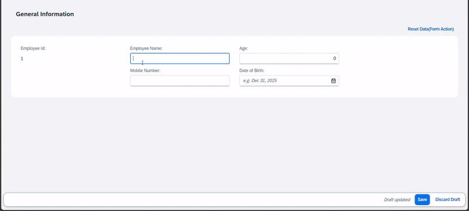

# 𝗔𝗰𝘁𝗶𝗼𝗻𝘀/𝗜𝗻𝗹𝗶𝗻𝗲 𝗔𝗰𝘁𝗶𝗼𝗻𝘀 𝗶𝗻 𝗢𝗯𝗷𝗲𝗰𝘁 𝗣𝗮𝗴𝗲 𝗦𝗲𝗰𝘁𝗶𝗼𝗻𝘀

Have you ever faced a scenario where you wanted to add RAP actions specific to a section of the Object Page,not the entire page? If yes, this is for you!

You can achieve this by leveraging `@𝗨𝗜.𝗳𝗮𝗰𝗲𝘁` and `@𝗨𝗜.𝗳𝗶𝗲𝗹𝗱𝗚𝗿𝗼𝘂𝗽` annotations. It’s also possible to add inline actions using the 𝗶𝗻𝗹𝗶𝗻𝗲: 𝘁𝗿𝘂𝗲 property( available from SAP S/4HANA 2023 and in the latest public cloud versions).

Use Case Example: A colleague recently had a requirement to add a section-specific action to reset certain data, placing the action inside the relevant section made the UX cleaner and more intuitive.

`@UI.facet: [ {`\
 `label: 'General Information',`\
 `id: 'GeneralInfo',`\
 `purpose: #STANDARD,`\
 `position: 10 ,`\
 `type: #FIELDGROUP_REFERENCE,`\
 `targetQualifier: 'generalInfo'`\
 `} ]`

 `@UI.fieldGroup: [{`\
 `qualifier: 'generalInfo',`\
 `type: #FOR_ACTION,`\
 `position: 10,`\
 `dataAction: 'formAction',`\
 `inline: true,` //Action will be placed inside the section\
 `label: 'Reset Data(Form Action)',`\
 `emphasized: true }]`\
 `element;`

